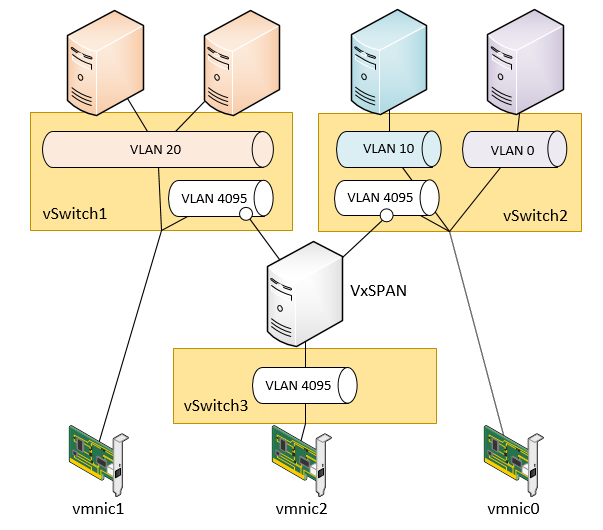
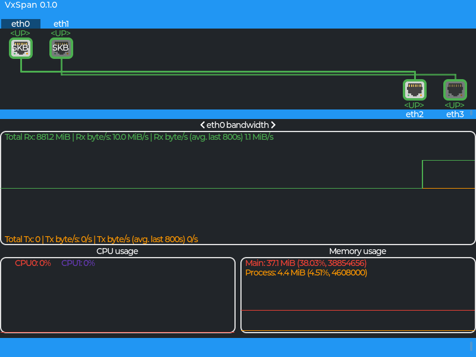

# VxSPAN
## About The Project
VxSPAN is minimalist port SPAN VM for standalone ESXi / standard vSwitch

<a href="images/schema.png"></a>
<a href="images/main.png"></a>

This project generates a bootable ISO including a Linux initramfs which runs XDP programs redirecting network packets

## Features
* Packet redirection and aggregation
* Copy any packet that is big enough to fit in an Ethernet frame
* Basic statistics: Rx/Tx bytes, packets and dropped per interface/VLAN, CPU and Memory
* No network communication other than defined redirections

## Requirement
* VMware hypervisor to run the VM (kernel is built with only VMXNET3 support)
* 1vCPU, 128MB RAM, no storage

## Usage
### Configuration
The basic configuration file is located at the initramfs root (`/vxspan.json`):

The following example will redirect:
* VLAN untagged traffic from eth0 interface to eth2 interface
* VLAN tagged traffic from eth1 interface to eth3 (VLAN 10 and 11) and eth2 interfaces (VLAN 12)

And will drop anything else.
```json
{
  "interfaces": {
    "eth0": {
      "redirect_map": {
        "none": "eth2"
      }
    },
    "eth1": {
      "redirect_map": {
        "10": "eth3",
        "11": "eth3",
        "12": "eth2"
      }
    }
  }
}
```
With:
```
<input>: {
	"redirect_map": {
	  <vlan>: <output>
	}	
}
```
VLAN Packet selector:
* `0` / `none`: Select untagged packets
* `1`-`4094`: Select 802.1q tag N
* `4095` / `any`: Select all traffic

### Building
1. Clone the repository:
```
git clone https://github.com/fl0l0u/vxspan.git
cd vxspan
```
2. Modify the `vxspan.json` to match your topology
3. Build the ISO
```
bash build_vxspan.sh
[...]
Removing intermediate container e46a581cb214
 ---> b6afa5e66883
Successfully built b6afa5e66883
Successfully tagged vxspan-build:latest
Done!
Extracting ISO to 'release/' directory:
- vxspan.iso
Extracting build artefacts to 'build/' directory:
- main
- xdp_redirect.o
- bzImage
11427 blocks
- rootfs.xz
```
4. Use the `vxspan.iso` in the `release/` directory
5. Configure a VM with the right amount of network adapters :)

### Running
Selecting network interface graph with arrow keys:
* `LEFT`/`RIGHT` to cycle interfaces
* `UP`/`DOWN` to select VLAN statistics for and input interface

Switch network chart display:
* `B`: display Rx/Tx bytes
* `P`: display Rx/Tx packets
* `D`: display Rx/Tx dropped packets

### Environment setup
VxSPAN is designed to be run on ESXi

## Limitations
* The current release is target to standalone ESXi, especially to collect network traffic from vSwitches
* `VMXNET3` adapter is the only one supported
* `XDP` mode is forced to `SKB` (`XDP_FLAGS_SKB_MODE`) which is supposedly less performent but experimentally is the only viable option
* `VMXNET3` with VLAN offloading enabled prevents the VLAN filtering in SKB mode
* Maximum 10 input interfaces and 10 output interfaces
* The main program GUI uses Frame buffer, which may not work perfectly outside of the VxSpan VM

## Development / Debug
A second Dockerfile (.dev) is provided to build a debug version of VxSPAN:
* Kernel with TTY support
* An initramfs including a busybox
* The `main` is compiled with debugging symbols
* The `main` application turns off display after losing TTY focus (switch twice - `ALT`+`ARROW` - to clear GUI artefacts from the screen)

### Qemu
The build artefacts can be run (poorly) on Qemu:
```
qemu-system-x86_64 -smp 4,sockets=4,cores=1 -m 128m -kernel vxspan/build/bzImage -initrd vxspan/build/rootfs.xz -vga std --append 'vga=789 vt.global_cursor_default=0 tsc=unstable ipv6.disable=1' -nic tap,model=vmxnet3 -nic tap,model=vmxnet3 -nic tap,model=vmxnet3 -nic tap,model=vmxnet3
```

### Performance testing
Testing setup on ESXi:
* Emulate each link with a Standard vSwitch without security or shaping policies 
  * Add a single portGroup with VLAN ID 4095
* Insert VMXNET3 adapter on each interface
![VM Hardware config][hw_config]
* Run trafgen in a second VM linked to one or more of these ports (example config in the `tests/` directory)
```
root@test-vm> trafgen -o ens37 -i trafgen.cfg --cpp --rate 100MiB -V
```
* Run iperf between two VMs linked to one of these ports
```
root@test-vm1> iperf -s
```
```
root@test-vm2> iperf -c test-vm1
```

## TODO List
- [ ] Add output VLAN encapsulation (RSPAN)
- [ ] Add a network stack and tunneling configuration to provide ERSPAN feature
- [ ] Management port with SNMP service to provide metrics and traps/informs

## License
This project is licensed under the GPL-3.0 License.

[preview]: images/main.png
[schema]: images/schema.png
[hw_config]: images/vm_hw_config.png